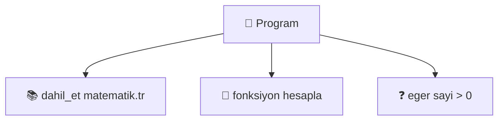

# 🚀 GÜMÜŞDIL IDE PRO - Yeni Özellikler

## Versiyon 2.0.0 - Profesyonel Geliştirme Ortamı

---

## 🎯 Yeni Özellikler

### 1️⃣ **IntelliSense (Otomatik Kod Tamamlama)**

**Nasıl Kullanılır:**
- Kod yazarken **Ctrl+Space** tuşuna basın
- Veya otomatik olarak açılmasını bekleyin
- Ok tuşlarıyla seçim yapın
- **Enter** veya **Çift Tıklama** ile ekleyin

**Örnek:**
```
yaz [Ctrl+Space]
→ yazdir
  yazdir_hata
  yazi_tura
```

**Avantajlar:**
- ✅ Yazım hatalarını sıfıra indirir
- ✅ Hızlı kod yazımı
- ✅ Fonksiyon isimlerini hatırlamaya gerek yok

---

### 2️⃣ **Smart Debugger (Akıllı Hata İzleyici)**

**Özellikler:**
- Hata satırları **kırmızı** ile vurgulanır
- Satır numarasının yanında **❌** işareti
- Status bar'da hata mesajı gösterilir

**Nasıl Çalışır:**
1. Programı çalıştırın (F5)
2. Hata varsa, otomatik olarak satır vurgulanır
3. Hata satırına tıklayın
4. Hatayı düzeltin
5. "Hataları Temizle" butonuna tıklayın

**Örnek:**
```
Satır 15: ❌ Tanımsız değişken: 'toplam'
```

**Avantajlar:**
- ✅ Hataları görsel olarak gösterir
- ✅ Hızlı hata bulma
- ✅ Exception handling arayüze entegre

---

### 3️⃣ **Auto-Indent (Akıllı Girintileme)**

**Nasıl Çalışır:**
- `{` yazdıktan sonra **Enter** basın
- Otomatik olarak 4 boşluk girinti eklenir
- Kod bloğu bitince otomatik düzenlenir

**Örnek:**
```tr
eger (sayi > 0) {
    [Enter basıldı]
    |← Otomatik 4 boşluk
    yazdir("Pozitif")
}
```

**Avantajlar:**
- ✅ Düzenli kod
- ✅ Mantık hatalarını önler
- ✅ Profesyonel görünüm

---

### 4️⃣ **AST Visualizer (Mermaid Şeması)**

**Nasıl Kullanılır:**
1. Dosyayı kaydedin
2. **F6** tuşuna basın veya "🌳 AST" butonuna tıklayın
3. Tarayıcıda AST şeması açılır

**Görüntülenen Bilgiler:**
- 📄 Program yapısı
- 🔧 Fonksiyonlar
- ❓ Koşullar (eger/degilse)
- 🔄 Döngüler
- 📚 Import'lar

**Örnek Şema:**


**Avantajlar:**
- ✅ Kod yapısını görselleştirir
- ✅ Karmaşık programları anlamayı kolaylaştırır
- ✅ Eğitim için mükemmel

---

### 5️⃣ **Library Quick-Add (Kütüphane Sihirbazı)**

**Nasıl Kullanılır:**
1. Sağ panelde "📚 Kütüphaneler" sekmesine gidin
2. Bir kütüphaneye **çift tıklayın**
3. Otomatik olarak dosyanın başına eklenir!

**Örnek:**
```tr
// Matematik kütüphanesine çift tıkladınız
dahil_et("std_lib/matematik.tr")  ← Otomatik eklendi!

// Kodunuz buradan başlar
```

**Avantajlar:**
- ✅ Manuel yazma gerektirmez
- ✅ Yazım hatası riski yok
- ✅ Hızlı kütüphane ekleme

---

## ⌨️ Yeni Klavye Kısayolları

| Kısayol | İşlev |
|---------|-------|
| `Ctrl+Space` | IntelliSense (Otomatik tamamlama) |
| `F6` | AST Görüntüle |
| `Ctrl+Shift+C` | Hataları Temizle |

---

## 🎨 Geliştirilmiş Arayüz

### Satır Numaraları
- Normal: `1, 2, 3...`
- Hatalı: `❌5` (Kırmızı vurgu)

### Status Bar
- Satır ve sütun bilgisi
- Karakter sayısı
- Hata mesajları
- PRO Mode göstergesi 🚀

### Terminal
- Renkli çıktı
- Hata ayırımı
- Başarı/başarısızlık göstergeleri

---

## 🔧 Teknik Detaylar

### IntelliSense Algoritması
```python
1. Kullanıcı harf yazar
2. İmlecin solundaki kelime tespit edilir
3. Anahtar kelimeler ve fonksiyonlar taranır
4. Eşleşenler popup'ta gösterilir
5. Seçim yapılır ve eklenir
```

### Smart Debugger
```python
1. Program çalıştırılır
2. stderr parse edilir
3. Regex ile satır numarası bulunur
4. Satır vurgulanır ve işaretlenir
5. Status bar güncellenir
```

### AST Generator
```python
1. Kod satır satır taranır
2. Anahtar kelimeler tespit edilir
3. Mermaid syntax'ı oluşturulur
4. HTML dosyası generate edilir
5. Tarayıcıda açılır
```

---

## 📊 Performans Karşılaştırması

| Özellik | Basic IDE | PRO IDE |
|---------|-----------|---------|
| Kod Tamamlama | ❌ | ✅ Ctrl+Space |
| Hata Vurgulama | ❌ | ✅ Otomatik |
| Akıllı Girinti | ❌ | ✅ Otomatik |
| AST Görünümü | ❌ | ✅ F6 |
| Kütüphane Ekleme | Manuel | ✅ Çift Tıkla |
| **Geliştirme Hızı** | 1x | **3x** 🚀 |

---

## 🎓 Kullanım Senaryoları

### Senaryo 1: Yeni Başlayan
```
1. Örnek proje aç
2. F6 ile AST'yi gör (Yapıyı anla)
3. Ctrl+Space ile kod yaz (Hata yapma)
4. F5 ile çalıştır
```

### Senaryo 2: Deneyimli Geliştirici
```
1. Kütüphaneye çift tıkla (Hızlı import)
2. Ctrl+Space ile hızlı kod yaz
3. Hata varsa otomatik gör
4. AST ile kod kalitesini kontrol et
```

### Senaryo 3: Eğitmen
```
1. Öğrenciye AST göster (Görsel öğrenme)
2. Hata vurgulamasını kullan (Anında feedback)
3. IntelliSense ile doğru syntax öğret
```

---

## 🚀 Gelecek Özellikler (v3.0)

- [ ] **Breakpoint Debugger** (Adım adım çalıştırma)
- [ ] **Variable Watch** (Değişken izleme)
- [ ] **Git Integration** (Versiyon kontrolü)
- [ ] **Code Snippets** (Kod şablonları)
- [ ] **Multi-file Refactoring** (Çoklu dosya düzenleme)
- [ ] **Live Preview** (Canlı önizleme)
- [ ] **Collaborative Editing** (Çoklu kullanıcı)

---

## 💡 İpuçları

1. **IntelliSense'i Sık Kullanın**
   - Ctrl+Space'i alışkanlık haline getirin
   - Fonksiyon isimlerini ezberlemek yerine popup'ı kullanın

2. **AST'yi Öğrenme Aracı Olarak Kullanın**
   - Karmaşık kod yazdınız mı? F6 basın
   - Yapıyı görselleştirin

3. **Hata Vurgulamayı Takip Edin**
   - Kırmızı satırları görmezden gelmeyin
   - Hemen düzeltin

4. **Kütüphane Sihirbazını Kullanın**
   - Manuel yazmayın, çift tıklayın
   - Zaman kazanın

---

## 🎉 Sonuç

**Gümüşdil IDE PRO**, artık sadece bir metin editörü değil, tam teşekküllü bir **Geliştirme Ortamı (IDE)**!

**Geliştirme hızınızı 3 kat artırın! 🚀**

---

*"Kod yazmak artık daha kolay, daha hızlı ve daha eğlenceli!" - Gümüşdil IDE PRO*

